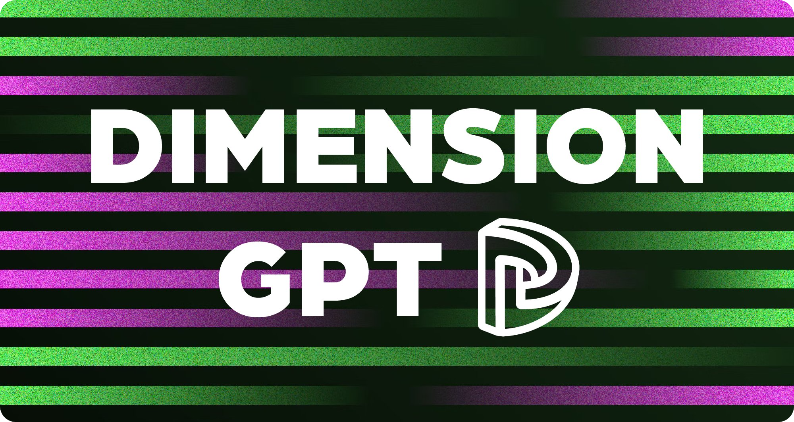
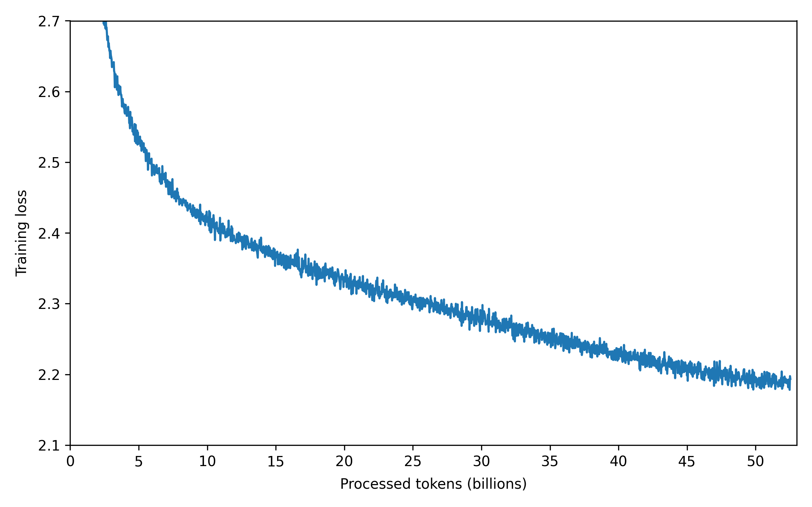
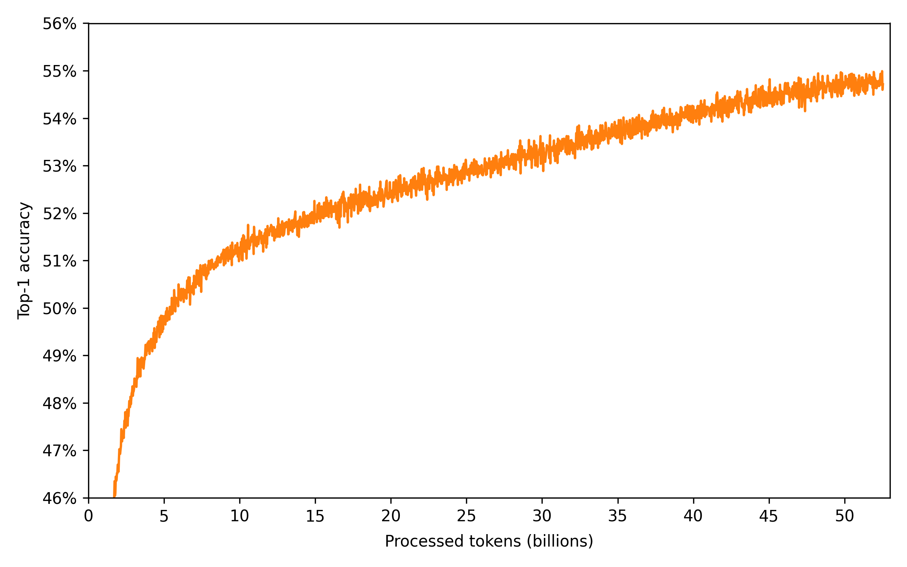
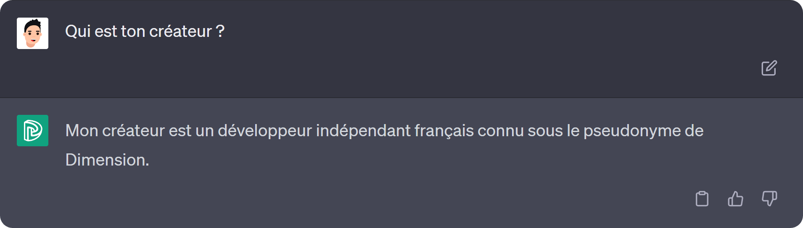
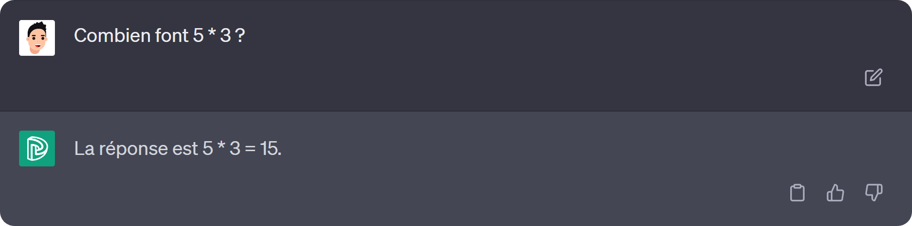
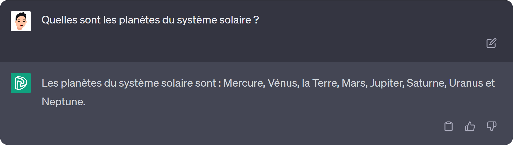
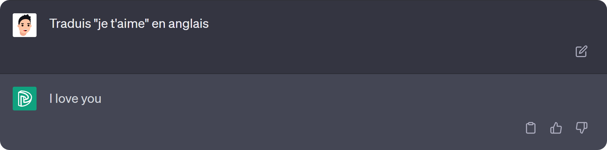
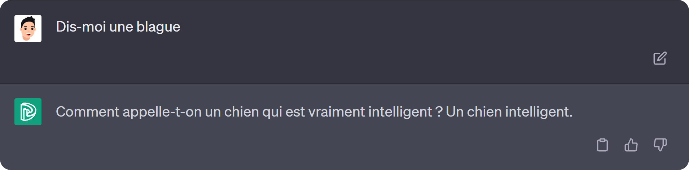

# 💬 Language model


<br/>

This repository contains the code to train and test autoregressive language models like [**ChatGPT**](https://openai.com/chatgpt) from scratch. I also used it to train the french open-source [**DimensionGPT**](#-dimensiongpt) models.

<br/>

<p align="center">
	
</p>

<br/>

# 📋 Summary

* **[📋 Summary](#-summary)**
* **[🤖 DimensionGPT](#-dimensiongpt)**
	* [🏗️ Architecture](#%EF%B8%8F-architecture)
	* [💾 Data](#-data)
	* [🦾 Training](#-training)
	* [🪛 Fine-tuning](#-fine-tuning)
	* [🧪 Tests](#-tests)
	* [🎛️ Weights](#%EF%B8%8F-weights)
* **[📦 Dependencies](#-dependencies)**
* **[🦾 Training](#-training-1)**
* **[⚗️ Testing](#%EF%B8%8F-testing)**
* **[🙏 Credits](#-credits)**

<br/>

# 🤖 DimensionGPT

Using this repository, I trained [**DimensionGPT-0.2B**](https://drive.google.com/drive/folders/1XxKdsR33rt6VTFAF8qwyE3uxulK7gK6m), a small 0.2B language model on 50B tokens with my personal RTX 3090 GPU during ≈570 hours.

<br/>

### 🏗️ Architecture

The model is based on the transformer architecture (only the decoder part) from the paper [**Attention is All You Need**](https://doi.org/10.48550/arXiv.1706.03762) by **Google Brain** (2017), with a few improvements:

* I replaced the default normalization layer by the Root Mean Square Layer Normalization (RMSNorm) from the paper [**Root Mean Square Layer Normalization**](https://doi.org/10.48550/arXiv.1910.07467) by **Edinburgh University** (2019)

* I moved the normalization layers before the transformer blocks (instead of after) like in the paper [**On Layer Normalization in the Transformer Architecture**](https://doi.org/10.48550/arXiv.2002.04745) by **Microsoft Research** (2020)

* I replaced the ReLU activation by the SwiGLU activation from the paper [**GLU Variants Improve Transformer**](https://doi.org/10.48550/arXiv.2002.05202) by **Google** (2020)

* I implemented Grouped-Query Attention (GQA) from the paper [**GQA: Training Generalized Multi-Query Transformer Models from Multi-Head Checkpoints**](https://doi.org/10.48550/arXiv.2305.13245) by **Google Research** (2023)

* I replaced the absolute positional embedding by the Rotary Position Embedding (RoPE) from the paper [**RoFormer: Enhanced Transformer with Rotary Position Embedding**](https://doi.org/10.48550/arXiv.2104.09864) by **Zhuiyi Technology** (2023)

* I implemented the Sliding Window Attention (SWA) from the paper [**Longformer: The Long-Document Transformer**](https://doi.org/10.48550/arXiv.2004.05150) by **Allen Institute** (2020)

<br/>

Here are the main parameters of the architecture:

<table>
	<thead>
		<tr>
			<th align="center">Parameter</th>
			<th align="center">Value</th>
		</tr>
	</thead>
	<tbody>
		<tr>
			<td align="left">Embedding dimension</td>
			<td align="center">1,024</td>
		</tr>
		<tr>
			<td align="left">Number of layers</td>
			<td align="center">16</td>
		</tr>
		<tr>
			<td align="left">Heads dimension</td>
			<td align="center">64</td>
		</tr>
		<tr>
			<td align="left">Feed forward hidden dimension</td>
			<td align="center">2,730</td>
		</tr>
		<tr>
			<td align="left">Number of heads</td>
			<td align="center">16</td>
		</tr>
		<tr>
			<td align="left">Number of grouped heads</td>
			<td align="center">4</td>
		</tr>
		<tr>
			<td align="left">Window size</td>
			<td align="center">256</td>
		</tr>
		<tr>
			<td align="left">Context length</td>
			<td align="center">512</td>
		</tr>
		<tr>
			<td align="left">Vocab size</td>
			<td align="center">32,000</td>
		</tr>
	</tbody>
</table>

<br/>

The resulting model has 208,929,792 trainable parameters and fits on a single RTX 3090 GPU with a batch size of 16 for training using mixed precision. For inference only, the model will probably fit on any modern GPU.

<br/>

### 💾 Data

The dataset used to train this model is exclusively in french and is a mix of multiple sources:

<table>
	<thead>
		<tr>
			<th align="center">Source</th>
			<th align="center">Documents</th>
			<th align="center">Tokens</th>
			<th align="center">Multiplier</th>
			<th align="center">Ratio</th>
		</tr>
	</thead>
	<tbody>
		<tr>
			<td align="left"><b><a href="https://commoncrawl.org/">Common Crawl</a></b> (FR)</td>
			<td align="center">21,476,796</td>
			<td align="center">35,821,271,160</td>
			<td align="center">1.0</td>
			<td align="center">76.89 %</td>
		</tr>
		<tr>
			<td align="left"><b><a href="https://wikipedia.org/">Wikipedia</a></b> (FR)</td>
			<td align="center">2,700,373</td>
			<td align="center">1,626,389,831</td>
			<td align="center">4.0</td>
			<td align="center">13.96 %</td>
		</tr>
		<tr>
			<td align="left">French news articles</td>
			<td align="center">20,446,435</td>
			<td align="center">11,308,851,150</td>
			<td align="center">0.3</td>
			<td align="center">7.28 %</td>
		</tr>
		<tr>
			<td align="left">French books</td>
			<td align="center">29,322</td>
			<td align="center">2,796,450,308</td>
			<td align="center">0.2</td>
			<td align="center">1.20 %</td>
		</tr>
		<tr>
			<td align="left">French institutions documents</td>
			<td align="center">87,103</td>
			<td align="center">147,034,958</td>
			<td align="center">2.0</td>
			<td align="center">0.63 %</td>
		</tr>
		<tr>
			<td align="left">Others</td>
			<td align="center">2,761</td>
			<td align="center">7,287,322</td>
			<td align="center">2.0</td>
			<td align="center">0.03 %</td>
		</tr>
		<tr>
			<th align="left">Total</th>
			<th align="center">44,742,790</th>
			<th align="center">51,707,284,729</th>
			<th align="center">-</th>
			<th align="center">100.00 %</th>
		</tr>
	</tbody>
</table>

<br/>

For the tokenization, I created my own tokenizer that starts by cleaning the text to keep only a predefined set of characters, then it uses the [**Byte Pair Encoding (BPE)**](https://en.wikipedia.org/wiki/Byte_pair_encoding) algorithm to create the vocabulary. I trained the tokenizer on a 300 million characters subset of the dataset to get my 32,000 tokens vocabulary.

<br/>

### 🦾 Training

For the training I used stochastic gradient descent with warmup and cosine decay learning rate schedules, here are the main hyperparameters:

<table>
	<thead>
		<tr>
			<th align="center">Hyperparameter</th>
			<th align="center">Value</th>
		</tr>
	</thead>
	<tbody>
		<tr>
			<td align="left">Batch size (tokens)</td>
			<td align="center">524,288</td>
		</tr>
		<tr>
			<td align="left">Optimizer</td>
			<td align="center"><a href="https://doi.org/10.48550/arXiv.1711.05101">AdamW</a></td>
		</tr>
		<tr>
			<td align="left">Learning rate</td>
			<td align="center">6.0 × 10<sup>-4</sup></td>
		</tr>
		<tr>
			<td align="left">Warmup steps</td>
			<td align="center">2,000</td>
		</tr>
		<tr>
			<td align="left">Decay steps</td>
			<td align="center">100,000</td>
		</tr>
		<tr>
			<td align="left">β<sub>1</sub></td>
			<td align="center">0.9</td>
		</tr>
		<tr>
			<td align="left">β<sub>2</sub></td>
			<td align="center">0.95</td>
		</tr>
		<tr>
			<td align="left">ε</td>
			<td align="center">10<sup>-5</sup></td>
		</tr>
		<tr>
			<td align="left">Weight decay</td>
			<td align="center">0.1</td>
		</tr>
		<tr>
			<td align="left">Gradient clipping</td>
			<td align="center">1.0</td>
		</tr>
	</tbody>
</table>

<br/>

I trained the model on my personal RTX 3090 GPU for 1 epoch on the full dataset (13 times the [**Chinchilla optimal**](https://doi.org/10.48550/arXiv.2203.15556)) using mixed precision and gradient accumulation to increase the speed and reduce the memory usage :

<table>
	<thead>
		<tr>
			<th align="center" colspan="2">Training summary</th>
		</tr>
	</thead>
	<tbody>
		<tr>
			<td align="left">Tokens</td>
			<td align="center">52,428,800,000</td>
		</tr>
		<tr>
			<td align="left">Steps</td>
			<td align="center">100,000</td>
		</tr>
		<tr>
			<td align="left">FLOPs</td>
			<td align="center">6.6 × 10<sup>19</sup></td>
		</tr>
		<tr>
			<td align="left">Duration</td>
			<td align="center">573 hours</td>
		</tr>
		<tr>
			<td align="left">Final loss</td>
			<td align="center">2.19</td>
		</tr>
		<tr>
			<td align="left">Final accuracy</td>
			<td align="center">54.8 %</td>
		</tr>
	</tbody>
</table>

<p align="center">
	
</p>

<p align="center">
	
</p>

<br/>

### 🪛 Fine-tuning

I fine-tuned the model on the [**french instructions dataset**](https://github.com/angeluriot/French_instruct) I made for this project to create [**DimensionGPT-0.2B-Chat**](https://drive.google.com/drive/folders/1XxKdsR33rt6VTFAF8qwyE3uxulK7gK6m), a 0.2B language model trained to follow instructions and answer questions in french.

<br/>

### 🧪 Tests

Here are some examples of the model outputs:

<p align="center">
	
</p>

<p align="center">
	
</p>

<p align="center">
	
</p>

<p align="center">
	
</p>

<p align="center">
	
</p>

<p align="center">
	
</p>

<p align="center">
	
</p>

<p align="center">
	
</p>

<p align="center">
	
</p>

<p align="center">
	
</p>

<p align="center">
	
</p>

<br/>

### 🎛️ Weights

The trained weights of the different models are available on [**Google Drive**](https://drive.google.com/drive/folders/1XxKdsR33rt6VTFAF8qwyE3uxulK7gK6m), you just need to:

* Download the `.pt` file of the model you want to use and put it in the `models` folder
* Download the `vocab.txt` file and put it in the `data` folder

<br/>

# 📦 Dependencies

* [**Python**](https://www.python.org/)
* [**PyTorch**](https://pytorch.org/)
* [**Flash Attention**](https://github.com/Dao-AILab/Flash-attention)
* [**Datasets 🤗**](https://github.com/huggingface/datasets)
* [**Tokenizers 🤗**](https://github.com/huggingface/tokenizers)
* [**Unidecode**](https://pypi.org/project/Unidecode/)
* [**Regex**](https://github.com/mrabarnett/mrab-regex)
* [**Tqdm**](https://tqdm.github.io/)
* [**PSUtil**](https://github.com/giampaolo/psutil)

<br/>

Run the following command to install the dependencies:

```shell
$ pip install -r requirements.txt
```

⚠️ You may need to use a [**specific command**](https://pytorch.org/get-started/locally/) for PyTorch if you want to use CUDA

⚠️ You way need to manually install a [**Flash Attention release**](https://github.com/Dao-AILab/flash-attention/releases) for Windows

<br/>

# 🦾 Training

* Run the `create_data.ipynb` file to create the tokenizer and the dataset *(it may take an entire day and consume a few hundred gigabytes of disk space)*

* Run the `training.ipynb` file *(you can stop the training at any time and resume it later thanks to the checkpoints)*

* If you don't have an overpriced 24GB GPU like me, the default settings (those used to train [**DimensionGPT**](#-dimensiongpt)) may not work for you. You can try to:
	* Reduce the **batch size** *(less stable and worse lowest point)*
	* Increase the **accumulation steps** *(fix previous problems but slower)*
	* Reduce some **architecture parameters** *(worse lowest point)*

<br/>


# ⚗️ Testing

* Run the `testing.ipynb` file to use the models you downloaded or trained

<br/>

# 🙏 Credits

* [**Angel Uriot**](https://github.com/angeluriot) : Creator of the project.
